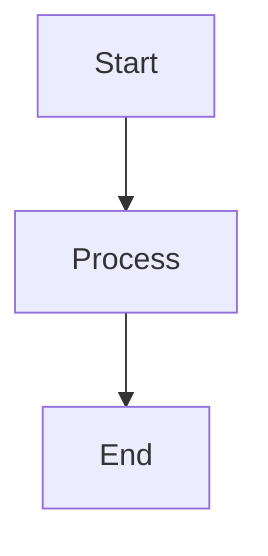

# Markdown + Mermaid Editor/Preview - Development Guide

## Project Overview

This comprehensive development guide explains how to build a Markdown editor with Mermaid diagram support. The application is a client-side, browser-based editor that allows users to write Markdown with Mermaid diagrams and see a live preview. Perfect for developers, technical writers, and students who need to create documentation with diagrams.

**Target Audience**: Developers, technical writers, students, documentation teams
**Use Cases**: Technical documentation, architecture diagrams, note-taking, specification writing
**Core Features**: Real-time preview, Mermaid diagram rendering, export to multiple formats, offline support

## Table of Contents

1. [Project Requirements](#project-requirements)
2. [Technology Stack](#technology-stack)
3. [Project Structure](#project-structure)
4. [Implementation Plan](#implementation-plan)
5. [Key Components](#key-components)
6. [Development Steps](#development-steps)
7. [Testing Strategy](#testing-strategy)
8. [Deployment](#deployment)

## Project Requirements

Based on the Product Requirements Document (PRD), the application must include:

### Core Features
- Two-pane layout: editor (left) + live preview (right)
- GitHub-flavored Markdown (GFM) rendering with Mermaid diagram support
- Export capabilities: Markdown, HTML, PDF, DOCX
- Local persistence via localStorage
- Works entirely client-side with no backend

### Functional Requirements
- Monospace code editor with Markdown syntax highlighting
- Live preview updates with debounced rendering (≤150ms typical)
- Mermaid diagram rendering within fenced code blocks
- File open/save via file picker or drag-and-drop
- Export to multiple formats with proper formatting
- Light/dark theme support

## Technology Stack

The project is built with:
- **Next.js 15** - React framework for production-ready applications
- **TypeScript** - Typed JavaScript for better code quality
- **Tailwind CSS** - Utility-first CSS framework for styling
- **React** - UI library for building components
- **Mermaid.js** - JavaScript library for rendering diagrams

## Project Structure

```
markdown-mermaid/
├── src/
│   └── app/
│       ├── page.tsx          # Main application page
│       ├── layout.tsx        # Root layout
│       └── globals.css       # Global styles
├── public/                   # Static assets
├── next.config.ts            # Next.js configuration
├── tsconfig.json             # TypeScript configuration
├── package.json              # Dependencies and scripts
└── PRD.md                    # Product requirements document
```

## Implementation Plan

### Phase 1: Basic Editor and Preview
1. Set up the two-pane layout (editor + preview)
2. Implement a basic text editor component
3. Create a live preview pane that renders Markdown
4. Add Mermaid diagram rendering

### Phase 2: File Handling and Persistence
1. Implement file open/save functionality
2. Add drag-and-drop support
3. Integrate localStorage for autosave

### Phase 3: Export Functionality
1. Implement Markdown export
2. Add HTML export with embedded Mermaid
3. Create PDF export via browser print
4. Implement DOCX export

### Phase 4: Advanced Features
1. Add theme switching (light/dark)
2. Implement find/replace functionality
3. Add keyboard shortcuts
4. Create settings/preferences panel

## Key Components

### 1. Editor Component
The editor component should:
- Use a monospace font for code editing
- Support syntax highlighting for Markdown
- Include line numbers
- Handle tab/shift+tab for indentation
- Support common keyboard shortcuts

### 2. Preview Component
The preview component should:
- Render Markdown with GFM support
- Render Mermaid diagrams within fenced code blocks
- Implement scroll synchronization with the editor
- Support light/dark themes

### 3. File Handler
The file handler should:
- Open files via file picker or drag-and-drop
- Save files via browser download
- Manage localStorage persistence
- Track "dirty" state for unsaved changes

### 4. Export Module
The export module should:
- Generate Markdown exports
- Create self-contained HTML with embedded Mermaid
- Produce PDFs via browser print functionality
- Generate DOCX files with proper formatting

## Development Steps

### Step 1: Setting up the Layout

First, we'll modify `src/app/page.tsx` to create the two-pane layout:

```tsx
'use client';

import { useState, useEffect } from 'react';

export default function Home() {
  const [markdown, setMarkdown] = useState<string>('# Hello World

This is a Mermaid diagram:


');
  
  return (
    <div className="flex flex-col h-screen">
      {/* Header */}
      <header className="border-b p-4 flex items-center justify-between">
        <h1 className="text-xl font-bold">Markdown + Mermaid Editor</h1>
        <div className="flex gap-2">
          <button className="px-3 py-1 bg-blue-500 text-white rounded">New</button>
          <button className="px-3 py-1 bg-blue-500 text-white rounded">Open</button>
          <button className="px-3 py-1 bg-blue-500 text-white rounded">Save</button>
          <button className="px-3 py-1 bg-green-500 text-white rounded">Export</button>
        </div>
      </header>
      
      {/* Main Content - Two Panes */}
      <div className="flex flex-1 overflow-hidden">
        {/* Editor Pane */}
        <div className="w-1/2 border-r overflow-auto">
          <textarea
            className="w-full h-full p-4 font-mono text-sm"
            value={markdown}
            onChange={(e) => setMarkdown(e.target.value)}
            spellCheck={false}
          />
        </div>
        
        {/* Preview Pane */}
        <div className="w-1/2 overflow-auto p-4">
          <div className="prose max-w-none">
            {/* Preview content will be rendered here */}
            <h1>Hello World</h1>
            <p>This is a Mermaid diagram:</p>
            {/* Mermaid diagram will be rendered here */}
          </div>
        </div>
      </div>
      
      {/* Status Bar */}
      <footer className="border-t p-2 text-sm flex justify-between">
        <div>Markdown + Mermaid Editor</div>
        <div>Lines: 0 | Words: 0</div>
      </footer>
    </div>
  );
}
```

### Step 2: Adding Markdown Rendering

Install the required dependencies:

```bash
npm install marked react-markdown remark-gfm
```

Update the preview pane to render Markdown:

```tsx
'use client';

import { useState, useEffect } from 'react';
import ReactMarkdown from 'react-markdown';
import remarkGfm from 'remark-gfm';

export default function Home() {
  const [markdown, setMarkdown] = useState<string>('# Hello World

This is a Mermaid diagram:


');
  
  return (
    <div className="flex flex-col h-screen">
      {/* Header */}
      <header className="border-b p-4 flex items-center justify-between">
        <h1 className="text-xl font-bold">Markdown + Mermaid Editor</h1>
        <div className="flex gap-2">
          <button className="px-3 py-1 bg-blue-500 text-white rounded">New</button>
          <button className="px-3 py-1 bg-blue-500 text-white rounded">Open</button>
          <button className="px-3 py-1 bg-blue-500 text-white rounded">Save</button>
          <button className="px-3 py-1 bg-green-500 text-white rounded">Export</button>
        </div>
      </header>
      
      {/* Main Content - Two Panes */}
      <div className="flex flex-1 overflow-hidden">
        {/* Editor Pane */}
        <div className="w-1/2 border-r overflow-auto">
          <textarea
            className="w-full h-full p-4 font-mono text-sm"
            value={markdown}
            onChange={(e) => setMarkdown(e.target.value)}
            spellCheck={false}
          />
        </div>
        
        {/* Preview Pane */}
        <div className="w-1/2 overflow-auto p-4">
          <div className="prose max-w-none">
            <ReactMarkdown remarkPlugins={[remarkGfm]}>
              {markdown}
            </ReactMarkdown>
          </div>
        </div>
      </div>
      
      {/* Status Bar */}
      <footer className="border-t p-2 text-sm flex justify-between">
        <div>Markdown + Mermaid Editor</div>
        <div>Lines: 0 | Words: 0</div>
      </footer>
    </div>
  );
}
```

### Step 3: Adding Mermaid Support

Install Mermaid:

```bash
npm install mermaid
```

Create a custom component for rendering Mermaid diagrams:

```tsx
// components/MermaidDiagram.tsx
'use client';

import { useEffect, useRef } from 'react';
import mermaid from 'mermaid';

mermaid.initialize({ 
  startOnLoad: true,
  theme: 'default',
  securityLevel: 'loose'
});

export default function MermaidDiagram({ 
  chart, 
  id 
}: { 
  chart: string; 
  id: string 
}) {
  const ref = useRef<HTMLDivElement>(null);

  useEffect(() => {
    if (ref.current) {
      mermaid.render(id, chart).then(({ svg, bindFunctions }) => {
        ref.current!.innerHTML = svg;
        bindFunctions?.(ref.current);
      }).catch((error) => {
        ref.current!.innerHTML = `<div class="text-red-500 p-4">Error rendering diagram: ${error.message}</div>`;
      });
    }
  }, [chart, id]);

  return <div ref={ref} className="mermaid" />;
}
```

Update the main page to handle Mermaid code blocks:

```tsx
// app/page.tsx
'use client';

import { useState, useEffect } from 'react';
import ReactMarkdown from 'react-markdown';
import remarkGfm from 'remark-gfm';
import { v4 as uuidv4 } from 'uuid';
import MermaidDiagram from '../components/MermaidDiagram';

export default function Home() {
  const [markdown, setMarkdown] = useState<string>(`# Hello World

This is a Mermaid diagram:

\`\`\`mermaid
graph TD
  A[Start] --> B[Process]
  B --> C[End]
\`\`\`
`);

  // Function to process Mermaid code blocks
  const processMermaid = (code: string, language: string) => {
    if (language === 'mermaid') {
      const id = `mermaid-${uuidv4()}`;
      return <MermaidDiagram chart={code} id={id} />;
    }
    return false;
  };

  return (
    <div className="flex flex-col h-screen">
      {/* Header */}
      <header className="border-b p-4 flex items-center justify-between">
        <h1 className="text-xl font-bold">Markdown + Mermaid Editor</h1>
        <div className="flex gap-2">
          <button className="px-3 py-1 bg-blue-500 text-white rounded">New</button>
          <button className="px-3 py-1 bg-blue-500 text-white rounded">Open</button>
          <button className="px-3 py-1 bg-blue-500 text-white rounded">Save</button>
          <button className="px-3 py-1 bg-green-500 text-white rounded">Export</button>
        </div>
      </header>
      
      {/* Main Content - Two Panes */}
      <div className="flex flex-1 overflow-hidden">
        {/* Editor Pane */}
        <div className="w-1/2 border-r overflow-auto">
          <textarea
            className="w-full h-full p-4 font-mono text-sm"
            value={markdown}
            onChange={(e) => setMarkdown(e.target.value)}
            spellCheck={false}
          />
        </div>
        
        {/* Preview Pane */}
        <div className="w-1/2 overflow-auto p-4">
          <div className="prose max-w-none">
            <ReactMarkdown 
              remarkPlugins={[remarkGfm]}
              components={{
                code({ node, inline, className, children, ...props }) {
                  const match = /language-(\w+)/.exec(className || '');
                  const language = match?.[1];
                  const code = String(children).replace(/\n$/, '');
                  
                  if (!inline && language === 'mermaid') {
                    const id = `mermaid-${uuidv4()}`;
                    return <MermaidDiagram chart={code} id={id} />;
                  }
                  
                  return <code className={className} {...props}>{children}</code>;
                }
              }}
            >
              {markdown}
            </ReactMarkdown>
          </div>
        </div>
      </div>
      
      {/* Status Bar */}
      <footer className="border-t p-2 text-sm flex justify-between">
        <div>Markdown + Mermaid Editor</div>
        <div>Lines: 0 | Words: 0</div>
      </footer>
    </div>
  );
}
```

### Step 4: Adding File Handling

Install uuid for generating unique IDs:

```bash
npm install uuid
npm install @types/uuid --save-dev
```

Add file handling functionality:

```tsx
// app/page.tsx (partial update)
'use client';

import { useState, useEffect, useRef } from 'react';
import ReactMarkdown from 'react-markdown';
import remarkGfm from 'remark-gfm';
import { v4 as uuidv4 } from 'uuid';
import MermaidDiagram from '../components/MermaidDiagram';

export default function Home() {
  const [markdown, setMarkdown] = useState<string>(() => {
    // Load from localStorage if available
    if (typeof window !== 'undefined') {
      return localStorage.getItem('markdown-content') || `# Hello World

This is a Mermaid diagram:

\`\`\`mermaid
graph TD
  A[Start] --> B[Process]
  B --> C[End]
\`\`\`
`;
    }
    return `# Hello World

This is a Mermaid diagram:

\`\`\`mermaid
graph TD
  A[Start] --> B[Process]
  B --> C[End]
\`\`\`
`;
  });
  
  const fileInputRef = useRef<HTMLInputElement>(null);

  // Save to localStorage whenever markdown changes
  useEffect(() => {
    const handler = setTimeout(() => {
      localStorage.setItem('markdown-content', markdown);
    }, 2000);
    
    return () => clearTimeout(handler);
  }, [markdown]);

  // Handle file open
  const handleOpen = () => {
    if (fileInputRef.current) {
      fileInputRef.current.click();
    }
  };

  // Handle file selection
  const handleFileSelect = (e: React.ChangeEvent<HTMLInputElement>) => {
    const file = e.target.files?.[0];
    if (file) {
      const reader = new FileReader();
      reader.onload = (event) => {
        setMarkdown(event.target?.result as string || '');
      };
      reader.readAsText(file);
    }
  };

  // Handle file save
  const handleSave = () => {
    const blob = new Blob([markdown], { type: 'text/markdown' });
    const url = URL.createObjectURL(blob);
    const a = document.createElement('a');
    a.href = url;
    a.download = 'document.md';
    document.body.appendChild(a);
    a.click();
    document.body.removeChild(a);
    URL.revokeObjectURL(url);
  };

  // Handle drag and drop
  const handleDrop = (e: React.DragEvent<HTMLDivElement>) => {
    e.preventDefault();
    const file = e.dataTransfer.files?.[0];
    if (file && file.name.endsWith('.md')) {
      const reader = new FileReader();
      reader.onload = (event) => {
        setMarkdown(event.target?.result as string || '');
      };
      reader.readAsText(file);
    }
  };

  const handleDragOver = (e: React.DragEvent<HTMLDivElement>) => {
    e.preventDefault();
  };

  // Function to process Mermaid code blocks
  const processMermaid = (code: string, language: string) => {
    if (language === 'mermaid') {
      const id = `mermaid-${uuidv4()}`;
      return <MermaidDiagram chart={code} id={id} />;
    }
    return false;
  };

  return (
    <div className="flex flex-col h-screen">
      {/* Hidden file input */}
      <input
        type="file"
        ref={fileInputRef}
        className="hidden"
        accept=".md"
        onChange={handleFileSelect}
      />
      
      {/* Header */}
      <header className="border-b p-4 flex items-center justify-between">
        <h1 className="text-xl font-bold">Markdown + Mermaid Editor</h1>
        <div className="flex gap-2">
          <button 
            className="px-3 py-1 bg-blue-500 text-white rounded"
            onClick={() => setMarkdown('')}
          >
            New
          </button>
          <button 
            className="px-3 py-1 bg-blue-500 text-white rounded"
            onClick={handleOpen}
          >
            Open
          </button>
          <button 
            className="px-3 py-1 bg-blue-500 text-white rounded"
            onClick={handleSave}
          >
            Save
          </button>
          <button className="px-3 py-1 bg-green-500 text-white rounded">Export</button>
        </div>
      </header>
      
      {/* Main Content - Two Panes */}
      <div 
        className="flex flex-1 overflow-hidden"
        onDrop={handleDrop}
        onDragOver={handleDragOver}
      >
        {/* Editor Pane */}
        <div className="w-1/2 border-r overflow-auto">
          <textarea
            className="w-full h-full p-4 font-mono text-sm"
            value={markdown}
            onChange={(e) => setMarkdown(e.target.value)}
            spellCheck={false}
          />
        </div>
        
        {/* Preview Pane */}
        <div className="w-1/2 overflow-auto p-4">
          <div className="prose max-w-none">
            <ReactMarkdown 
              remarkPlugins={[remarkGfm]}
              components={{
                code({ node, inline, className, children, ...props }) {
                  const match = /language-(\w+)/.exec(className || '');
                  const language = match?.[1];
                  const code = String(children).replace(/\n$/, '');
                  
                  if (!inline && language === 'mermaid') {
                    const id = `mermaid-${uuidv4()}`;
                    return <MermaidDiagram chart={code} id={id} />;
                  }
                  
                  return <code className={className} {...props}>{children}</code>;
                }
              }}
            >
              {markdown}
            </ReactMarkdown>
          </div>
        </div>
      </div>
      
      {/* Status Bar */}
      <footer className="border-t p-2 text-sm flex justify-between">
        <div>Markdown + Mermaid Editor</div>
        <div>
          Lines: {markdown.split('\n').length} | 
          Words: {markdown.split(/\s+/).filter(Boolean).length}
        </div>
      </footer>
    </div>
  );
}
```

### Step 5: Adding Export Functionality

Add export functions for different formats:

```tsx
// utils/export.ts
export const exportToHTML = (markdown: string, title: string = 'Document') => {
  const html = `<!DOCTYPE html>
<html>
<head>
  <meta charset="utf-8">
  <title>${title}</title>
  <style>
    body { font-family: -apple-system, BlinkMacSystemFont, 'Segoe UI', Roboto, sans-serif; max-width: 800px; margin: 0 auto; padding: 2rem; }
    code { background-color: #f0f0f0; padding: 0.2em 0.4em; border-radius: 3px; }
    pre { background-color: #f8f8f8; padding: 1rem; overflow-x: auto; border-radius: 5px; }
    blockquote { border-left: 4px solid #ddd; padding-left: 1rem; margin: 0; color: #666; }
    table { border-collapse: collapse; width: 100%; }
    th, td { border: 1px solid #ddd; padding: 0.5rem; }
    th { background-color: #f8f8f8; }
  </style>
  <script type="module">
    import mermaid from 'https://cdn.jsdelivr.net/npm/mermaid@10/dist/mermaid.esm.min.mjs';
    mermaid.initialize({ startOnLoad: true });
  </script>
</head>
<body>
  <div id="content">${markdown}</div>
  <script>
    // This would be where we render the markdown to HTML
    // For now, we're just showing the raw markdown
  </script>
</body>
</html>`;
  
  const blob = new Blob([html], { type: 'text/html' });
  const url = URL.createObjectURL(blob);
  const a = document.createElement('a');
  a.href = url;
  a.download = `${title}.html`;
  document.body.appendChild(a);
  a.click();
  document.body.removeChild(a);
  URL.revokeObjectURL(url);
};

export const exportToPDF = () => {
  window.print();
};

export const exportToMarkdown = (markdown: string, title: string = 'document') => {
  const blob = new Blob([markdown], { type: 'text/markdown' });
  const url = URL.createObjectURL(blob);
  const a = document.createElement('a');
  a.href = url;
  a.download = `${title}.md`;
  document.body.appendChild(a);
  a.click();
  document.body.removeChild(a);
  URL.revokeObjectURL(url);
};
```

Update the header to include export functionality:

```tsx
// In the header buttons section
<button 
  className="px-3 py-1 bg-green-500 text-white rounded"
  onClick={() => exportToMarkdown(markdown, 'document')}
>
  Export MD
</button>
<button 
  className="px-3 py-1 bg-green-500 text-white rounded"
  onClick={() => exportToHTML(markdown, 'document')}
>
  Export HTML
</button>
<button 
  className="px-3 py-1 bg-green-500 text-white rounded"
  onClick={exportToPDF}
>
  Export PDF
</button>
```

### Step 6: Adding Theme Support

Add theme switching functionality:

```tsx
// app/page.tsx (partial update)
const [theme, setTheme] = useState<'light' | 'dark'>(() => {
  if (typeof window !== 'undefined') {
    return localStorage.getItem('theme') as 'light' | 'dark' || 'light';
  }
  return 'light';
});

// Apply theme to document
useEffect(() => {
  document.documentElement.classList.toggle('dark', theme === 'dark');
  localStorage.setItem('theme', theme);
}, [theme]);

// In the status bar
<div className="flex items-center gap-2">
  <button 
    onClick={() => setTheme(theme === 'light' ? 'dark' : 'light')}
    className="px-2 py-1 rounded border"
  >
    {theme === 'light' ? '🌙' : '☀️'}
  </button>
  <div>
    Lines: {markdown.split('\n').length} | 
    Words: {markdown.split(/\s+/).filter(Boolean).length}
  </div>
</div>
```

Update the MermaidDiagram component to support themes:

```tsx
// components/MermaidDiagram.tsx
'use client';

import { useEffect, useRef } from 'react';
import mermaid from 'mermaid';

export default function MermaidDiagram({ 
  chart, 
  id,
  theme = 'default'
}: { 
  chart: string; 
  id: string;
  theme?: 'default' | 'dark' | 'forest' | 'neutral';
}) {
  const ref = useRef<HTMLDivElement>(null);

  useEffect(() => {
    mermaid.initialize({ 
      startOnLoad: true,
      theme,
      securityLevel: 'loose'
    });

    if (ref.current) {
      mermaid.render(id, chart).then(({ svg, bindFunctions }) => {
        ref.current!.innerHTML = svg;
        bindFunctions?.(ref.current);
      }).catch((error) => {
        ref.current!.innerHTML = `<div class="text-red-500 p-4">Error rendering diagram: ${error.message}</div>`;
      });
    }
  }, [chart, id, theme]);

  return <div ref={ref} className="mermaid" />;
}
```

## Testing Strategy

### Manual Testing
1. **Editor Functionality**
   - Test typing and real-time preview updates
   - Verify syntax highlighting
   - Check line numbers and scroll behavior

2. **Mermaid Rendering**
   - Test different diagram types (flowchart, sequence, etc.)
   - Verify error handling for invalid diagrams
   - Check rendering performance with complex diagrams

3. **File Operations**
   - Test opening various Markdown files
   - Verify drag-and-drop functionality
   - Confirm save functionality works correctly
   - Check localStorage persistence

4. **Export Features**
   - Test Markdown export
   - Verify HTML export with embedded diagrams
   - Check PDF export quality
   - Validate DOCX export (if implemented)

5. **Theme Switching**
   - Test light/dark theme switching
   - Verify theme persistence across sessions
   - Confirm Mermaid diagrams adapt to theme

### Automated Testing
1. **Unit Tests**
   - Test Markdown parsing functions
   - Verify Mermaid rendering components
   - Check export utility functions

2. **Integration Tests**
   - Test file handling workflows
   - Verify editor-preview synchronization
   - Check theme switching behavior

3. **End-to-End Tests**
   - Simulate user workflows from opening to exporting
   - Test cross-browser compatibility
   - Verify performance benchmarks

## Deployment

### Local Development
```bash
npm run dev
```

### Production Build
```bash
npm run build
npm start
```

### Deployment Options
1. **Vercel** (Recommended)
   - Connect GitHub repository to Vercel
   - Automatic deployments on push to main branch
   - Zero configuration required

2. **Other Platforms**
   - Netlify
   - GitHub Pages
   - Self-hosted server

### Environment Variables
No environment variables are required for this client-side application.

## Future Enhancements

1. **Enhanced Editor Features**
   - Syntax highlighting within the editor
   - Auto-completion for Markdown and Mermaid
   - Find/replace functionality
   - Spell-check toggle

2. **Advanced Export Options**
   - Configurable PDF options (margins, page size)
   - DOCX styling customization
   - Export history

3. **Additional Features**
   - Table of contents panel
   - Markdown linting
   - Custom CSS themes
   - Collaboration features (for future versions)

4. **Performance Optimizations**
   - Virtualized editor for large documents
   - Debounced preview rendering
   - Memory usage optimization

This guide provides a comprehensive roadmap for implementing the Markdown + Mermaid Editor/Preview application according to the PRD requirements. Each step builds upon the previous one, ensuring a solid foundation for the application.
```